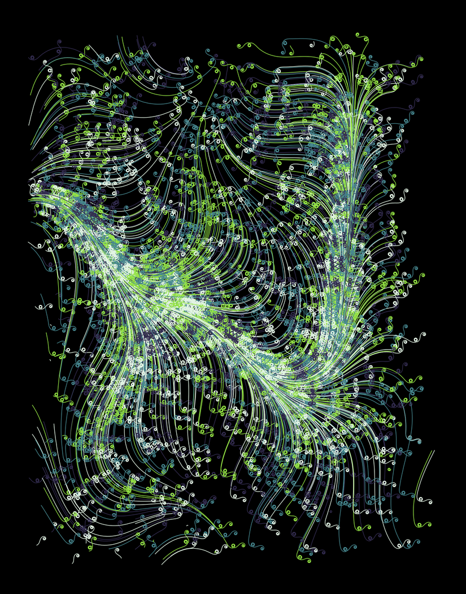
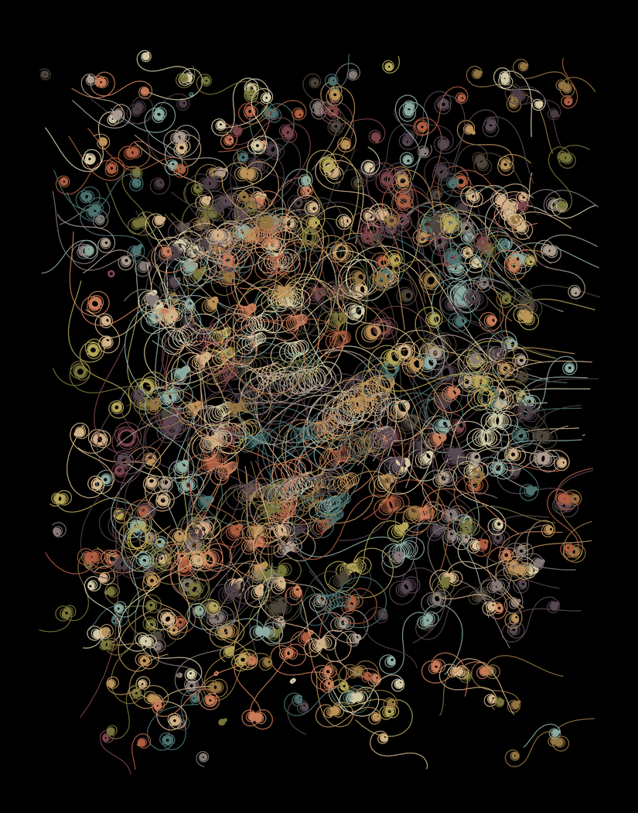
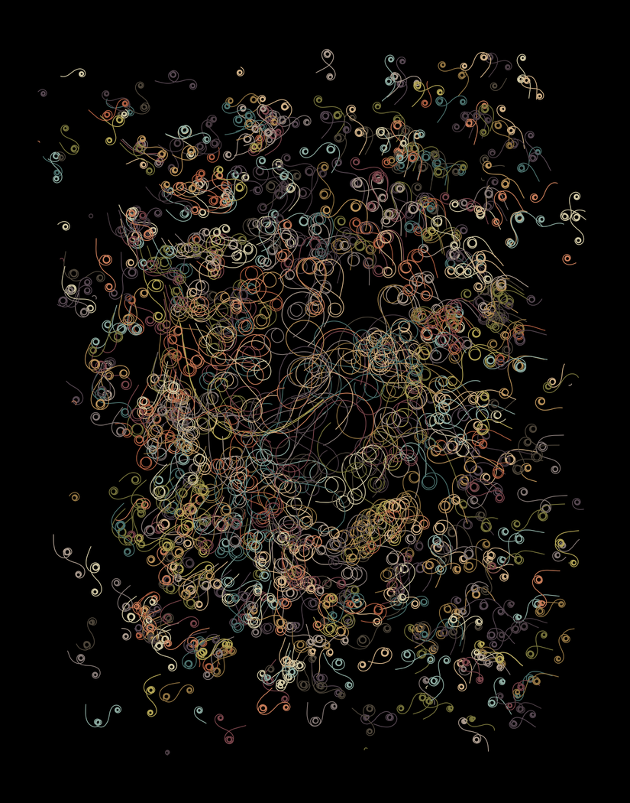
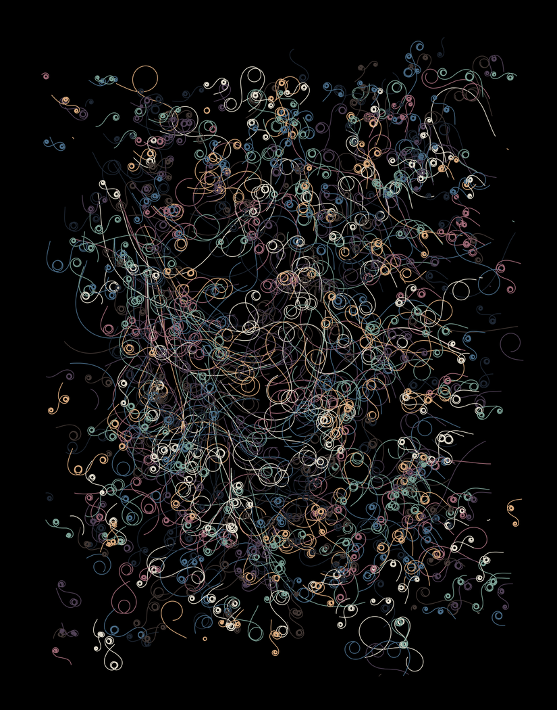
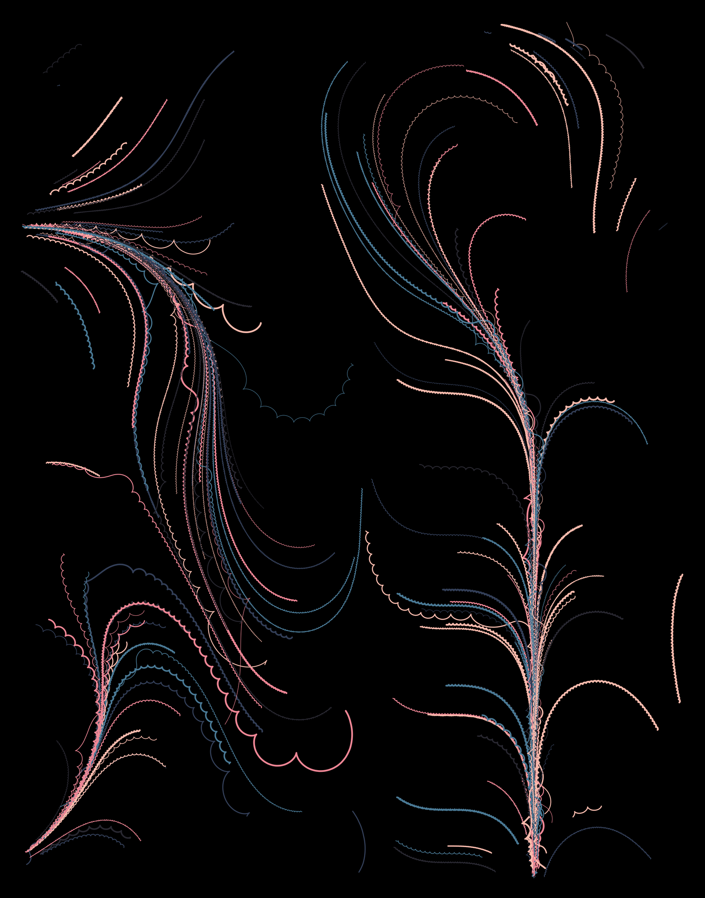

# Generative Art Algorutoms

Hello! This is a repository for my generative art efforts.

I've been always obsessed with lines drawing. 
Early before high school, sitting
in front of old 486 Win PC in a class, I started QBasic and trew lines and circles to the black screen.
I remember how teacher told me what am i going to do with these lines and whether i want to start doing something normal, like websockets may be?...

So i'm doin something **normal** now: [Linkedin](https://www.linkedin.com/in/mikhail-spirin-6b0b1837/).

This is a repo for black screen + lines, squares and other shapes. 25 years later.
Feel free to reuse the code and create something beautiful!

*Art is everything you need*

# Installation
git clone ..
cd ..
python -m venv .venv
source .venv/bin/activate
pip install requirements.txt

# General usage notes
Now python ex*.py in any dirs should work and generate new images.

More specific comments and examples are here:

- [cubes](cubes/README.md)
- [flowfields](flowfields/README.md)
- [planepacking](planepacking/README.md)
- [recursion](recursion/README.md)

# Examples

